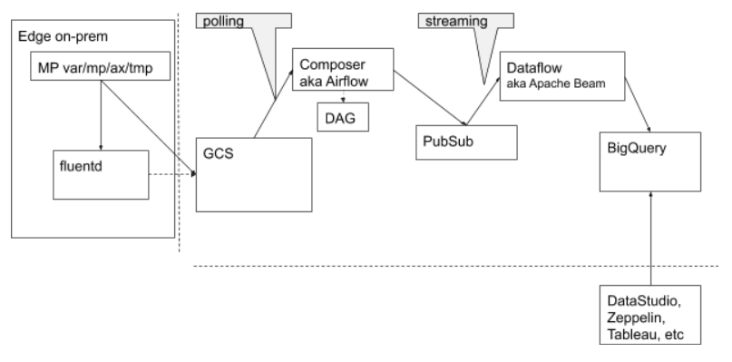

# edge-ax-bigquery-datastudio

The project contains collateral for AX/BigData/Data Studio Accelerator.





# Pipeline on Edge/MP Side

_NOTES_: 
* ? on centos 6, td-agent fluentd plugin conflicts with edge/thridparty rpm repo
* on GCP td-agent default ports conflict with google-fluentd

### Configure MPs

1. On every MP node, copy ./target/edge-fluent-data-uploader-1.0.0.jar file to  
```
/opt/apigee/edge-gateway/lib/thirdparty/edge-fluent-data-uploader-1.0.0.jar
```

2. On every MP node, configure
```
/opt/apigee/customer/application/message-processor.properties

conf_datalake-ingestion_datastore.tsBucketInterval=120000
conf_datalake-ingestion_datalake.ingestion.turnedOn=true
conf_datalake-ingestion_datastore.DataUploader=com.exco.EdgeFluentDataUploader
conf_datalake-ingestion_datastore.recoveryDirBatchSize=10
conf_datalake-ingestion_uap.collectionService=http://localhost:8888/ax.test
conf_datalake-ingestion_uap.repository=edge
conf_datalake-ingestion_uap.dataset=api
```
3. Restart mp


### Configure fluentd plugin

1. Install td-agent

2. Configure plugin in /etc/td-agent/plugin td-agent.conf file
```
/etc/td-agent/td-agent.conf
```

3. Configure http input, match to fluentd sink fragments of
```
/etc/td-agent/plugin/parser_ax.rb

<source>
  @type http
  @id input_http
  port 8888

  <parse>
    @type ax
  </parse>
</source>
...

<match ax.test>
  @type copy
 
    <store>
        @type elasticsearch
        host localhost
        port 9200
        index_name fluentd
        type_name fluentd
        <buffer>
                flush_interval 1s
         </buffer>
  </store>
# debug:
#  <store>
#   @type stdout
#   @id output_stdout
#  </store>
</match>
```
4. Restart td-agent
```
sudo systemctl status td-agent.service
sudo systemctl restart td-agent.service
sudo systemctl stop td-agent.service
```


# Pipeline Configurations on a 'BigData' side

## In the CloudShell: define project environement variables; jumpbox; and service account configuration

1. In a GCP project open CloudShell.

    ```
    gcloud alpha cloud-shell ssh
    ```

1. Fetch ctl-setenv.sh and ctl-jumpbox-and-sa.sh files from repo
(It might be easlier to clone the whole repo.)


1. Copy and edit ctl-setenv.sh as desired into your ../ctl-setenv-<$PROJECT_ID>.sh. I.e. as minimum, edit those variables:

    ```
    export PROJECT_ID=myproject
    export REGION_ID=europe-west2
    export ZONE_ID=europe-west2-a
    export BUCKET=$PROJECT_ID-repo
    ...

    export GOOGLE_SERVICE_ACCOUNT=ax-service
    ```
1. Source the ../ctl-setenv-<$PROJECT_ID>.sh

1. Execute ctl-jumpbox-and-sa.sh script to provision jumpbox and configure service account and required roles, permissions, and scopes.

    ```
    ctl-jumpbox-and-sa.sh
    ```


NOTE: From this point on, we are going to use jumpbox and ax-service account to manage Edge/AX@GCP project.


## At the jumpbox: setup edge, edgeax, and gcp pipeline

1. Login into the jumpbox server

1. Install utilities required by 
    ```
    sudo yum -y install git jq wget mc httpd-tools maven
    ```

1. Put ctl-setenv-<$PROJECT_ID>.sh file to ~/ctl-setenv-<$PROJECT_ID>.sh.

1. source ctl-setenv-<$PROJECT_ID>.sh

    ```
    . ~/ctl-setenv-<$PROJECT_ID>.sh
    ```

## At the Jumpbox: continue installation 

1. Copy file or contents of -privatekey.json file stored into to your home folder ~ to $GOOGLE_SERVICE_CREDENTIALS and set file permissions.
    ```
    sudo mkdir -p $(dirname $GOOGLE_SERVICE_CREDENTIALS)
    sudo chown -R $USER: $(dirname $GOOGLE_SERVICE_CREDENTIALS)
    cp $(basename $GOOGLE_SERVICE_CREDENTIALS) $GOOGLE_SERVICE_CREDENTIALS
    sudo chmod 0600 $GOOGLE_SERVICE_CREDENTIALS
    ```


1. git clone >>this repo<<

    _TODO: remove from external version!!!_
    For source.google.com

    1. Get password token

    ```
    https://source.developers.google.com/new-password
    ```
    1. clone repo:
    ```
    git clone https://source.developers.google.com/p/apigee-emea/r/edge-ax-gcs-ps-bq-gds
    ```

1. Activate service-account identity
    ```
    gcloud auth activate-service-account --key-file=$GOOGLE_SERVICE_CREDENTIALS

    cd edge-ax-gcs-ps-bq-gds
    export PATH=$PATH:$PWD
    ```

1. Instantiate Apigee repo credentials and Edge license file to files:
    ```
    sudo mkdir /opt/apigee-install
    sudo chown $USER: /opt/apigee-install
    ```

    NOTE: It is up to you to obtain credntials and license for OPDK and put then into the following files:
    ```
    /opt/apigee-install/credentials.txt
        User: <username
        Password: <software.apigee.com password>

    /opt/apigee-install/license.txt
        <single string of the license base64 string>
    ```


## Install edge 5 node and provision org/env/proxies

    ```
    ctl-edge.sh provision
    ctl-edge.sh edge
    ctl-edge.sh org

    # install edge side of the ax pipeline
    ctl-edge-ax.sh  

    # install gcp side of the ax pipeline
    ctl-gcspsbq.sh provision
    ```


    NOTE: If something gets wrong, use nukeitout actions of ctl-edge.sh and ctl-gcspsbq.sh commands.
    ## To remove the setup

    * ./ctl-nukeitout.sh


# Disclaimer

This example is not an official Google product, nor is it part of an official Google product.

## License

This material is copyright 2018-2019, Google LLC.
and is licensed under the Apache 2.0 license. See the [LICENSE](LICENSE) file.

## Status

This is a community supported project. There is no warranty for this code.
If you have problems or questions, ask on [commmunity.apigee.com](https://community.apigee.com).
